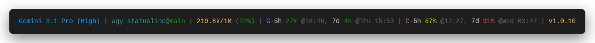
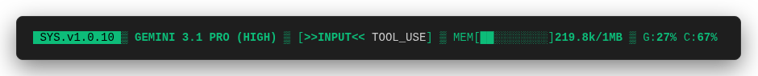

# ⚡ agy-statusline

A blazing-fast, infinitely customizable status line plugin for the Antigravity CLI.

It hooks natively into AGY, reading the internal state stream to render a live, zero-latency HUD on every keystroke. No background polling. No lag.

## ✨ Features
- **Zero Network Lag**: Instant context tracking using AGY's native state stream.
- **100% Programmable**: Don't like our layout? Write your own custom widgets in pure JavaScript. 
- **Zero Dependencies**: Pure Node.js. No `node_modules` clutter.

## 🚀 Installation

Install the plugin by cloning the repository and registering it with AGY:

```bash
git clone https://github.com/Sam-297/agy-statusline ~/.agy-plugins/agy-statusline
agy plugin install ~/.agy-plugins/agy-statusline
```

## 🎨 Themes

Check out the [`themes/`](themes/) directory for pre-built configurations you can copy and paste!

| Default Line | Retro Progress Bar | Dashboard |
|---|---|---|
|  |  |  |
| *The classic agy-statusline.* | *Replaces tokens with a progress bar.* | *Multi-line, bordered TUI dashboard.* |

**To use a theme:**
Because the plugin runs globally, you keep your personal layout configuration safely in your user home directory.

Download your preferred theme using `curl`:

*Dashboard Theme:*
```bash
mkdir -p ~/.config/agy-statusline
curl -o ~/.config/agy-statusline/config.js https://raw.githubusercontent.com/Sam-297/agy-statusline/main/themes/dashboard.js
```

*Retro Progress Bar Theme:*
```bash
mkdir -p ~/.config/agy-statusline
curl -o ~/.config/agy-statusline/config.js https://raw.githubusercontent.com/Sam-297/agy-statusline/main/themes/progress-bar.js
```

## 🛠️ Customizability

Unlike plugins that force you to use static JSON, `agy-statusline` is fully programmable.

To customize your HUD, create this file: `~/.config/agy-statusline/config.js`

### Available Built-in Segments

You can arrange these built-in strings in any order:
- `"model"`: e.g. `Gemini Pro`
- `"cwd_branch"`: e.g. `~@main` or `agy-statusline@feat`
- `"cwd"`: e.g. `~` or `agy-statusline`
- `"branch"`: e.g. `main`
- `"tokens"`: e.g. `1.5k/10k (15%)`
- `"quota_gemini"`: Google API rate limits (`G·5h ...`)
- `"quota_anthropic"`: Anthropic API rate limits (`C·5h ...`)
- `"quota_openai"`: OpenAI API rate limits (`O·5h ...`)
- `"version"`: e.g. `v1.0.10`
- `"extras"`: Tool confirmation warnings and sandbox flags
- `"email_masked"`: Masked email (`s***@gmail.com`)
- `"email"`: Full email address
- `"session_id_short"`: Truncated session ID
- `"session_id"`: Full session ID
- `"agent_state"`: Current agent state
- `"plan_tier"`: Your subscription tier
- `"product"`: The AGY product name
- `"artifact_count"`: Number of artifacts in the session
- `"output_tokens"`: Separate output token counter (`Out:15.7k`)
- `"sandbox"`: Shows 🔒 if sandbox is enabled
- `"exceeds_200k"`: Shows ⚠>200k warning if true

### Accessing Raw Data (Dynamic Extraction)

If you don't like our built-in formatting (e.g., `G·5h` or `1.5k/10k`) and want absolute low-level control, `agy-statusline` exposes the raw JSON payload in two ways:

#### 1. Dot-Notation Strings (Quick & Raw)
If you include a string in your `segments` array that isn't built-in, `agy-statusline` will attempt to extract it directly from the live AGY JSON payload using dot-notation.

For example, if you just want the raw input token count without any colors or formatting, add this to your segments:
`"context_window.current_usage.input_tokens"`

It will instantly render the exact number on your screen.

#### 2. JavaScript Functions (Absolute Control)
For total control over how raw data is parsed and styled, pass a function. Your function receives the live `payload` object directly from AGY.

```javascript
export default {
  separator: " • ",
  segments: [
    (payload, utils) => {
      // Access the raw data directly, ignoring our built-in opinionated formatting
      const gemini = payload?.quota?.['gemini-5h'];
      if (!gemini) return '';
      
      // Build your own exact format!
      return `Google: ${Math.round(gemini.remaining_fraction * 100)}% left`;
    }
  ]
};
```

### Writing Custom Segments

If the built-ins aren't enough, just write a JavaScript function. Your function receives the live `payload` from AGY, plus a `utils` object loaded with TrueColor ANSI wrappers and number formatters.

```javascript
export default {
  separator: " • ",
  segments: [
    "model",
    "cwd_branch",
    
    // Write your own segment in pure JS!
    (payload, utils) => {
      const mem = process.memoryUsage().heapUsed / 1024 / 1024;
      return utils.colors.purple(`RAM: ${Math.round(mem)}MB`);
    },
    
    "tokens"
  ]
};
```


## 🔒 Privacy
Operates purely offline. All metrics are parsed safely from AGY's internal stream.
