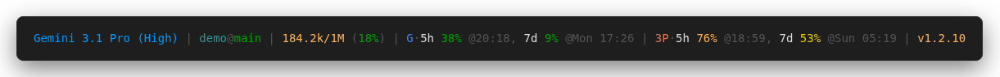
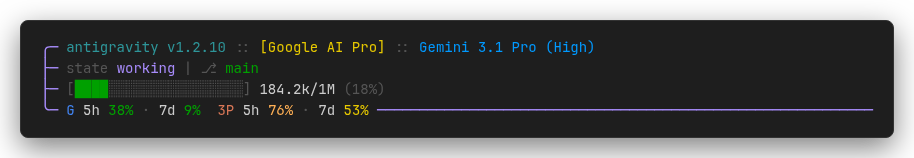

# agy-statusline

**A fast, programmable status line for the Antigravity CLI (agy).**

agy's built-in status line shows the model name. `agy-statusline` shows what you actually need while you work: your Gemini and third-party quota with reset times, context-window usage, the git branch, and more. You can rearrange all of it, or write your own segments in JavaScript.




- **Fast:** ~20 ms on top of Node's own startup, and zero runtime dependencies.
- **Works on Linux, macOS and Windows** (PowerShell or cmd).
- **Eight themes** built in (including powerline and a quota-focused one), and a config that's plain JavaScript when you want more.
- **Never gets in agy's way:** a slow or broken segment shows an inline marker instead of breaking the line.

## Install

Requires Node.js 20+.

```bash
npm i -g https://github.com/Sam-297/agy-statusline/releases/latest/download/agy-statusline.tgz
agy-statusline install
```

Restart agy. `install` points agy's `statusLine` setting at `agy-statusline` and remembers what was there before. Run the same `npm i -g …` line again to update to the latest release.

**Uninstall:** `agy-statusline uninstall`, then `npm rm -g @sam-297/agy-statusline`.

**From source:**

```bash
git clone https://github.com/Sam-297/agy-statusline
cd agy-statusline
npm link
agy-statusline install
```

## Themes

```bash
agy-statusline themes           # list
agy-statusline preview          # see them all, rendered with sample data
agy-statusline theme quota      # switch (agy picks it up on its next refresh)
```

Want your own layout? See the **[Themes & Customization guide](themes/README.md)**.

## Troubleshooting

- **Nothing shows up:** restart agy. Then check that `statusLine.command` in `~/.gemini/antigravity-cli/settings.json` (Windows: `%USERPROFILE%\.gemini\antigravity-cli\settings.json`) says `agy-statusline` or points at this package.
- **A `⚠ …` appears in the line:** it's a problem with your config, such as a typo'd segment name or a syntax error. Fix `~/.config/agy-statusline/config.mjs`.
- **A segment shows `[name: timeout]`:** a custom segment took longer than 300 ms. Make it faster or cache its result.
- **Windows, installed from source into a folder with spaces:** agy on Windows can't run such paths. Install the release instead (see above).
- **`powerline` shows boxes instead of arrows:** that theme needs a [Nerd Font](https://www.nerdfonts.com/) in your terminal.

## How it works

agy runs the status line command on every refresh and pipes session JSON (model, context window, quota, …) to it on stdin. What agy sends and how it runs the command on each OS is documented in [docs/agy-contract.md](docs/agy-contract.md).

## License

MIT
