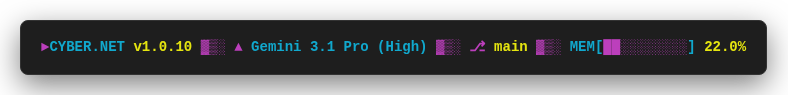
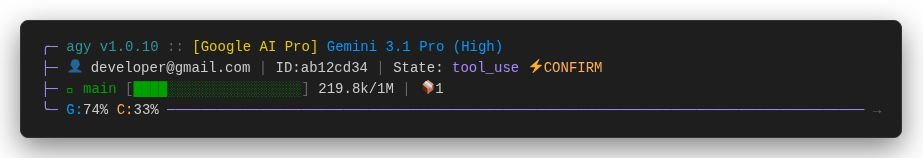
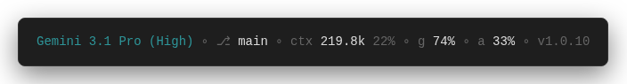
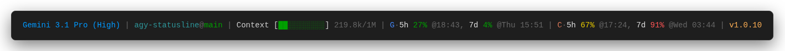

# agy-statusline Themes

This directory contains pre-built themes for `agy-statusline`. 

## How to Apply a Theme

To apply a theme, run the `--load-theme` command corresponding to your OS. Once loaded, restart your `agy` session to see the new status line in action.

### Default


To go back to the standard, minimalist default look:

**macOS / Linux:**
```bash
node ~/.agy-plugins/agy-statusline/bin/agy-statusline --load-theme default
```
**Windows (PowerShell):**
```powershell
node $HOME\.agy-plugins\agy-statusline\bin\agy-statusline --load-theme default
```

### Cyberpunk



**macOS / Linux:**
```bash
node ~/.agy-plugins/agy-statusline/bin/agy-statusline --load-theme cyberpunk
```
**Windows (PowerShell):**
```powershell
node $HOME\.agy-plugins\agy-statusline\bin\agy-statusline --load-theme cyberpunk
```

### Dashboard



**macOS / Linux:**
```bash
node ~/.agy-plugins/agy-statusline/bin/agy-statusline --load-theme dashboard
```
**Windows (PowerShell):**
```powershell
node $HOME\.agy-plugins\agy-statusline\bin\agy-statusline --load-theme dashboard
```

### Elegant



**macOS / Linux:**
```bash
node ~/.agy-plugins/agy-statusline/bin/agy-statusline --load-theme elegant
```
**Windows (PowerShell):**
```powershell
node $HOME\.agy-plugins\agy-statusline\bin\agy-statusline --load-theme elegant
```

### Progress Bar



**macOS / Linux:**
```bash
node ~/.agy-plugins/agy-statusline/bin/agy-statusline --load-theme progress-bar
```
**Windows (PowerShell):**
```powershell
node $HOME\.agy-plugins\agy-statusline\bin\agy-statusline --load-theme progress-bar
```

### Retro


**macOS / Linux:**
```bash
node ~/.agy-plugins/agy-statusline/bin/agy-statusline --load-theme retro
```
**Windows (PowerShell):**
```powershell
node $HOME\.agy-plugins\agy-statusline\bin\agy-statusline --load-theme retro
```

## Custom Themes

The plugin comes with a fully-featured built-in CLI to manage your own personalized themes. 

### How to Create a Custom Theme

To build your own theme, simply edit your active configuration file located at:
- **Mac/Linux:** `~/.config/agy-statusline/config.mjs`
- **Windows:** `$HOME\.config\agy-statusline\config.mjs`

Because the configuration file is pure JavaScript, you can export whatever layout you like using the built-in segments, or even write your own custom functions! You can use an included theme to tweak it or create an entirely new one.

**Example Custom Layout:**
```javascript
export default {
  separator: " | ",
  segments: [
    "cwd_branch",
    "model",
    "tokens",
    // You can even write inline custom functions!
    (payload, utils) => payload.sandbox?.enabled ? '🔒 SECURE' : ''
  ]
};
```

#### Available Built-in Segments

You can mix and match any of these pre-built strings in your `segments` array:
`"model"`, `"cwd_branch"`, `"cwd"`, `"branch"`, `"tokens"`, `"output_tokens"`, `"quota_gemini"`, `"quota_anthropic"`, `"quota_openai"`, `"version"`, `"extras"`, `"agent_state"`, `"plan_tier"`, `"product"`, `"session_id"`, `"session_id_short"`, `"email"`, `"email_masked"`, `"artifact_count"`, `"sandbox"`, `"exceeds_200k"`.

### Managing Your Themes

Whenever you manually edit your configuration file to create a layout you like, you can save it so you don't lose it when testing other themes. 

**1. Save your active config as a theme:**
This securely copies your current active config to the internal themes directory.
- **Mac/Linux:** `node ~/.agy-plugins/agy-statusline/bin/agy-statusline --save-theme <name>`
- **Windows:** `node $HOME\.agy-plugins\agy-statusline\bin\agy-statusline --save-theme <name>`

**2. List all available themes:**
Shows both pre-built themes and your saved custom themes.
- **Mac/Linux:** `node ~/.agy-plugins/agy-statusline/bin/agy-statusline --list-themes`
- **Windows:** `node $HOME\.agy-plugins\agy-statusline\bin\agy-statusline --list-themes`

**3. Load your custom theme:**
Applies the theme back to your active configuration (just like the pre-built themes above).
- **Mac/Linux:** `node ~/.agy-plugins/agy-statusline/bin/agy-statusline --load-theme <name>`
- **Windows:** `node $HOME\.agy-plugins\agy-statusline\bin\agy-statusline --load-theme <name>`

**4. Delete a custom theme:**
Deletes the theme from the saved list.
- **Mac/Linux:** `node ~/.agy-plugins/agy-statusline/bin/agy-statusline --delete-theme <name>`
- **Windows:** `node $HOME\.agy-plugins\agy-statusline\bin\agy-statusline --delete-theme <name>`
