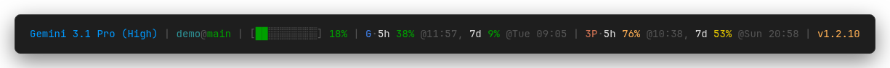
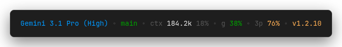
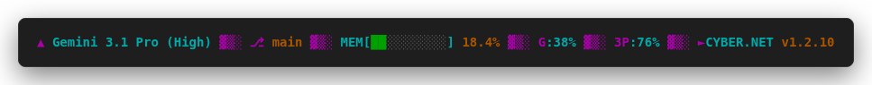
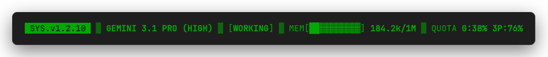

# Themes & Customization

## Pick a theme

```bash
agy-statusline themes              # list
agy-statusline preview [name]      # render with sample data
agy-statusline theme <name>        # switch
```

agy picks up the change on its next refresh, so there's no need to restart.

| Theme | |
|---|---|
| `default` |  |
| `progress-bar` |  |
| `elegant` |  |
| `dashboard` |  |
| `cyberpunk` |  |
| `retro` |  |

## Your config

`~/.config/agy-statusline/config.mjs` (or `$XDG_CONFIG_HOME/agy-statusline/config.mjs`; on Windows `%USERPROFILE%\.config\agy-statusline\config.mjs`). `agy-statusline install` creates it. It's plain JavaScript:

```js
export default {
  theme: 'default',            // start from a theme…
  separator: ' | ',            // …and override anything
  segments: [
    'model',
    'cwd_branch',
    'context',
    'quota_gemini',
    // Custom segment: return a string ('' hides it). Must finish within 300 ms.
    (payload, utils) => (payload.sandbox?.enabled ? utils.colors.green('sandboxed') : ''),
    // With a priority: higher is kept longer when the terminal is narrow (built-ins use 1–10).
    { name: 'mine', priority: 9, render: (payload, utils) => 'always here' },
  ],
};
```

If something in the config is wrong (unknown segment, syntax error), a yellow `⚠ …` shows up in the status line, telling you what.

When the terminal is too narrow, the lowest-priority segments are dropped first. A single segment that's still too wide gets truncated with `…`. Multi-line layouts (a `'\n'` separator) truncate each line instead.

## Built-in segments

| Segment | Shows | Priority |
|---|---|---|
| `model` | Model name | 10 |
| `context` | Context used / size and % (`21.4k/250k (9%)`) | 9 |
| `context_bar` | Context as a colored bar | 8 |
| `quota_gemini` | Gemini quota used, 5h and 7d, with reset times | 8 |
| `quota_3p` | Third-party (Claude/GPT) quota used, 5h and 7d, with reset times | 7 |
| `cwd_branch` | Folder name and git branch (`demo@main`) | 6 |
| `cwd` | Folder name (`~` for home) | 5 |
| `branch` | Git branch | 5 |
| `agent_state` | `idle` / `working` / … | 4 |
| `flags` | `sandbox` + `exceeds_200k` together | 4 |
| `exceeds_200k` | `⚠ >200k` when over 200k tokens | 4 |
| `sandbox` | 🔒 when sandboxed | 3 |
| `output_tokens` | Total output tokens | 3 |
| `plan_tier` | e.g. `Google AI Pro` | 2 |
| `product` | `antigravity` | 2 |
| `session_id_short` | First 8 characters of the session id | 2 |
| `email_masked` | `j***@example.com` | 2 |
| `email` | Your full account email (think before screenshots) | 2 |
| `version` | agy version | 1 |

**Aliases** (from 1.x): `tokens` → `context`, `quota_anthropic` / `quota_openai` → `quota_3p`, `extras` → `flags`, `session_id` → `session_id_short`.

**Payload paths:** any top-level payload field (`plan_tier`, `terminal_width`, …) or dotted path (`'context_window.used_percentage'`) prints that value.

## `utils` reference

The second argument every custom segment receives:

| | |
|---|---|
| `colors.*` | `dim`, `blue`, `orange`, `green`, `cyan`, `red`, `yellow`, `purple`, `white`, `googleBlue`, `claudeOrange`, `openaiGreen`, `stripAnsi` |
| `formatNumber(n)` | `21367` → `21.4k` |
| `format.pctColor(pct)` | Returns the color function for a percentage (green → yellow → orange → red) |
| `format.bar(pct, length?, { full?, empty? })` | Colored progress bar |
| `format.formatTime(date)` / `formatDayTime(date)` | `14:05` / `Mon 14:05` |
| `data.getModel(p)` | Model name or `null` |
| `data.getCwd(p)` | Working directory |
| `data.getBranch(p)` | Git branch or `null` |
| `data.getContext(p)` | `{ used, total, pct }` or `null` |
| `data.getQuota(p, 'gemini' \| '3p')` | `{ h5, weekly }` with `{ usedPct, resetAt }` each, or `null` |
| `displayWidth(str)` / `truncate(str, width)` | Terminal-column-aware (ANSI, emoji, CJK) |
| `width` | Columns available for the line |

The full payload agy sends: [docs/agy-contract.md](../docs/agy-contract.md#payload).

## Upgrading from 1.x

- `--setup`, `--load-theme <name>` and `--list-themes` still work (as `install`, `theme`, `themes`).
- `--save-theme` and `--delete-theme` were removed: themes are picked by name now, and your customizations live in `config.mjs`.
- An old config with copied theme code keeps working. `agy-statusline theme <name>` backs it up to `config.mjs.bak` before switching.
- Replace the old `hooks/status-line.*` command in agy's settings by running `agy-statusline install`.
